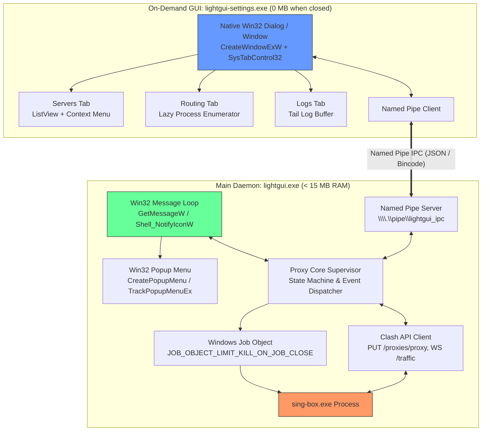
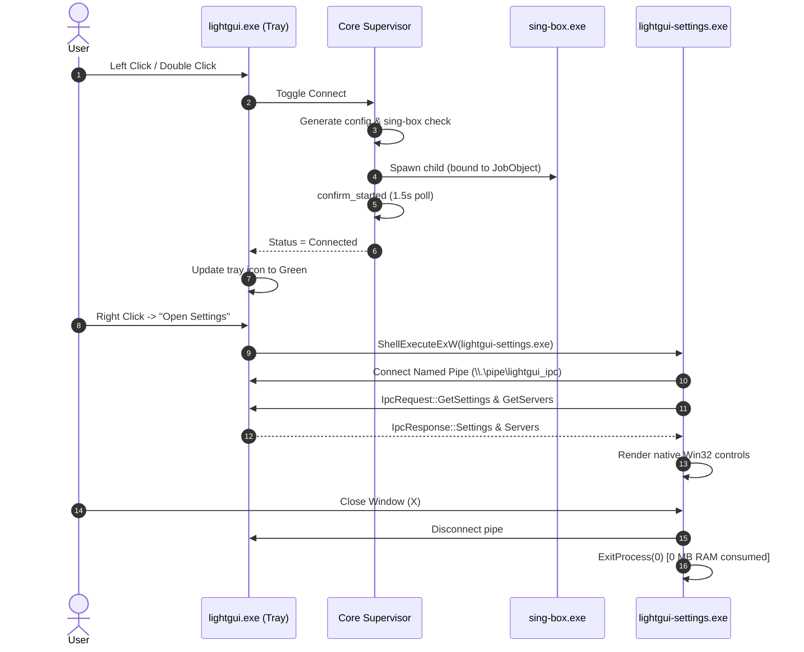

# Lightgui Architecture Specification

## 1. Vision & Architecture Principles

**Lightgui** is an ultra-lightweight, high-performance native Windows client for sing-box designed to replace Umbra (`myguiproxy`). 

### Core Design Tenets
1. **Zero Web Technologies**: No WebView2, no Chromium processes, no React, no Node.js dependencies.
2. **Strict Memory Budget**: Tray application operates in **< 15 MB RAM** at idle (compared to 150–220 MB in Umbra).
3. **Zero Idle CPU**: Pure event-driven Win32 message loop (`GetMessageW`) with zero polling loops.
4. **On-Demand UI (Zero Steady-State Cost)**: The settings interface runs as a separate native process (`lightgui-settings.exe`) launched on demand. When closed, it terminates completely—leaving **0 MB** footprint.
5. **Modular Rust Workspace**: Clean separation of core domain logic, UI presentation, and IPC communication.

---

## 2. Workspace Structure

The project is structured as a cargo workspace:

```text
lightgui/
├── Cargo.toml
├── crates/
│   ├── lightgui-core/         # Headless proxy engine, protocols, and OS integration
│   │   ├── Cargo.toml
│   │   └── src/
│   │       ├── models/        # Server, Settings, Routing, and Subscription models
│   │       ├── storage/       # Atomic file storage and V1->V2 schema migration
│   │       ├── parser/        # VLESS, Hysteria2 link and URI parsers
│   │       ├── singbox/       # Process runner, JobObject, config gen, Clash API
│   │       ├── net/           # WinINET proxy, ping latency, traffic stats
│   │       ├── hwid/          # Cryptographic machine GUID hashing & hardware ID
│   │       └── ipc/           # Named Pipe protocol frames and serialization
│   │
│   ├── lightgui-tray/         # Main background executable (lightgui.exe)
│   │   ├── Cargo.toml
│   │   └── src/
│   │       ├── main.rs        # WinMain entry point, single-instance mutex
│   │       ├── win32/         # Shell_NotifyIconW, message loop, popup menu
│   │       ├── service/       # Proxy lifecycle manager, hot switching, supervisor
│   │       └── ipc_server.rs  # Named Pipe server (\\.\pipe\lightgui_ipc)
│   │
│   └── lightgui-settings/     # On-demand native GUI (lightgui-settings.exe)
│       ├── Cargo.toml
│       └── src/
│           ├── main.rs        # WinMain, Common Controls initialization
│           ├── window/        # Native tab control, ListViews, custom paint
│           ├── tabs/          # Servers, Routing, General Settings, Logs
│           └── ipc_client.rs  # Named Pipe client communicating with tray daemon
└── resources/
    ├── icons/                 # System tray and window icons (.ico)
    └── sing-box.exe           # sing-box runtime binary
```

---

## 3. High-Level Component & IPC Diagram



---

## 4. Crate Specifications

### 4.1 `lightgui-core`
The platform engine containing all non-UI functionality:
- **`models`**: Data definitions for `Settings`, `ServerEntry`, `ProxyKind` (`VlessNode`, `Hysteria2Node`), `RouteRule`, `Subscription`.
- **`storage`**:
  - Atomic JSON disk persistence (`write_json` using `<filename>.tmp` and atomic replace).
  - V1 $\to$ V2 schema migrations preserving backward compatibility with Umbra config directories.
- **`parser`**:
  - `vless.rs`: Handles `vless://` URIs with Reality, TCP, WebSocket, gRPC, HTTPUpgrade, flow `xtls-rprx-vision`, and strict URI query preservation.
  - `hysteria2.rs`: Handles `hysteria2://` / `hy2://` with authentication, SNI fallback, and Salamander obfuscation.
- **`singbox`**:
  - `runner.rs`: Spawns `sing-box.exe` with `CREATE_NO_WINDOW`, assigns it to Windows Job Object (`JOB_OBJECT_LIMIT_KILL_ON_JOB_CLOSE`), verifies startup in 1.5s window (`confirm_started`), and provides 3s graceful teardown.
  - `supervisor.rs`: Crash detection and exponential backoff retry loop (1s, 3s, 9s, up to 3 attempts, 60s health reset).
  - `config.rs`: Pure AST generation for sing-box 1.13+ config format (DNS, inbounds, outbounds, routing rules).
  - `clash_api.rs`: REST and WebSocket client for dynamic selector switching (`PUT /proxies/proxy`), delay testing (`GET /proxies/<tag>/delay`), and live traffic streaming.
- **`net`**:
  - `system_proxy.rs`: Modifies `HKCU\Software\Microsoft\Windows\CurrentVersion\Internet Settings` (`ProxyEnable`, `ProxyServer`, `ProxyOverride`), notifies WinINET via `InternetSetOptionW`, and backs up registry state before writes for crash recovery.
  - `traffic.rs`: Queries Windows IP Helper `GetIfTable2` for live byte counters on the `lightgui-tun` virtual interface.
  - `ping.rs`: Concurrent asynchronous TCP latency testing (concurrency 8, 3s timeout).
  - `processes.rs`: Process list enumeration combining `EnumWindows` and `CreateToolhelp32Snapshot`.
- **`hwid`**: Stable SHA-256 machine GUID generation and registry hardware string extraction.
- **`ipc`**: Frame format definitions, request/response enums, and pipe codecs.

### 4.2 `lightgui-tray` (`lightgui.exe`)
The always-on tray supervisor:
- **WinMain Entry Point**:
  - Checks for existing instance via named system Mutex (`Local\LightguiSingleInstanceMutex`). If already running, signals existing instance to show settings or popup menu and exits immediately.
  - Initializes `lightgui-core` state and loads persisted settings.
  - Performs system proxy startup recovery if an earlier crash left the proxy engaged.
- **Win32 Message Loop**:
  - Pure event-driven `GetMessageW` loop. Sleeps at the kernel scheduler level until an OS window message or tray event arrives; consumes **0.0% CPU** at idle.
  - Registers tray icon via `Shell_NotifyIconW` (`NIM_ADD`) with `NOTIFYICONDATAW`.
  - Listens for `WM_USER + 1` (tray callback).
- **Native Popup Menu**:
  - On right-click: dynamically constructs Win32 menu using `CreatePopupMenu`, `AppendMenuW`, and `TrackPopupMenuEx`.
  - Menu Items:
    - **Header**: Active Server Name & Status (Connected / Disconnected / Connecting)
    - **Connect / Disconnect** (Default action on double-click)
    - **Servers Submenu**: Quick-switch active server (1-click via Clash API)
    - **Mode Submenu**: Radio checks for "System Proxy" vs "TUN Mode"
    - **Open Settings...**: Launches `lightgui-settings.exe`
    - **Exit**: Full graceful teardown and process exit
- **IPC Named Pipe Server**:
  - Listens on `\\.\pipe\lightgui_ipc`.
  - Receives commands from `lightgui-settings.exe` (e.g. Save Settings, Refresh Subscription, Switch Server, Fetch Logs).
  - Pushes status changes and live traffic counters back to connected settings windows.

### 4.3 `lightgui-settings` (`lightgui-settings.exe`)
The on-demand configuration window:
- **Lifecycle**: Spawned only when requested by the user. Once closed, the process exits cleanly.
- **UI Framework**: Native Win32 API using Common Controls (`InitCommonControlsEx` with `ICC_TAB_CLASSES | ICC_LISTVIEW_CLASSES | ICC_STANDARD_CLASSES`).
- **Tab Layout**:
  - **Servers Tab**: Virtual ListView displaying node list, ping latencies, protocol type, and data usage. Action buttons for Add Link, Import Subscription, Ping All, and Delete.
  - **Routing Tab**: Rule table (Process, Domain, IP CIDR). Includes "Add Process" picker button that loads running processes **on-demand**.
  - **General Tab**: Mode selection (System Proxy vs TUN), mixed inbound port, autostart toggle, DNS configuration, and preset checkboxes (Discord voice UDP bypass, Russian anti-block rule-sets).
  - **Logs Tab**: ListView streaming core log messages from `lightgui-core` ring buffer.
- **Lazy Loading**:
  - Running processes are **never** enumerated until the user explicitly opens the "Add Process Rule" dialog.
  - Logs are fetched from the daemon only when the "Logs" tab is visible.

---

## 5. Inter-Process Communication (IPC) Protocol

Communication between `lightgui.exe` (tray daemon) and `lightgui-settings.exe` occurs over a standard Windows Named Pipe.

### 5.1 Pipe Endpoint & Access
- Pipe Name: `\\.\pipe\lightgui_ipc`
- Security: Discretionary Access Control List (DACL) restricting pipe access to the current user token (`SECURITY_ATTRIBUTES` with current user SID).

### 5.2 Framing & Wire Format
Messages use length-prefixed framing:
- **Header**: 4 bytes (u32 little-endian) representing payload length in bytes.
- **Payload**: Serialized JSON or Bincode frame.

```text
+-----------------------+---------------------------------------+
|  Payload Length (4B)  |       Serialized Frame (N Bytes)       |
+-----------------------+---------------------------------------+
```

### 5.3 Message Protocol Definition

```rust
#[derive(Debug, Serialize, Deserialize)]
pub enum IpcRequest {
    GetStatus,
    GetSettings,
    UpdateSettings(Settings),
    GetServers,
    SelectServer { server_id: String },
    Connect,
    Disconnect,
    SetMode { mode: Mode },
    FetchSubscription { url: String },
    PingServers { server_ids: Vec<String> },
    GetLogs { tail: usize },
    GetRunningProcesses,
}

#[derive(Debug, Serialize, Deserialize)]
pub enum IpcResponse {
    Status(ConnectionState),
    Settings(Settings),
    Servers(Vec<ServerEntry>),
    Logs(Vec<LogLine>),
    RunningProcesses(Vec<RunningProcess>),
    OperationResult { success: bool, message: Option<String> },
}
```

---

## 6. Process Lifecycle & State Flow



---

## 7. Safety, Recovery & Teardown

1. **Crash Isolation**: If `lightgui-settings.exe` encounters an unexpected fault, `lightgui.exe` and the background proxy tunnel continue uninterrupted.
2. **Crash Recovery of System Proxy**: If Windows is shut down abruptly while System Proxy is active, the pre-existing registry backup in `settings.json` is read by `lightgui.exe` on next boot and restored via `system_proxy::startup_recovery()`.
3. **Driver Cleanup Guarantee**: The Wintun adapter and WFP dynamic filters are held by kernel handles in `sing-box.exe`. Because `sing-box.exe` is bound to the kernel Job Object of `lightgui.exe`, terminating `lightgui.exe` by any means instantly destroys `sing-box.exe`, causing the kernel to tear down all adapters and dynamic filters.
